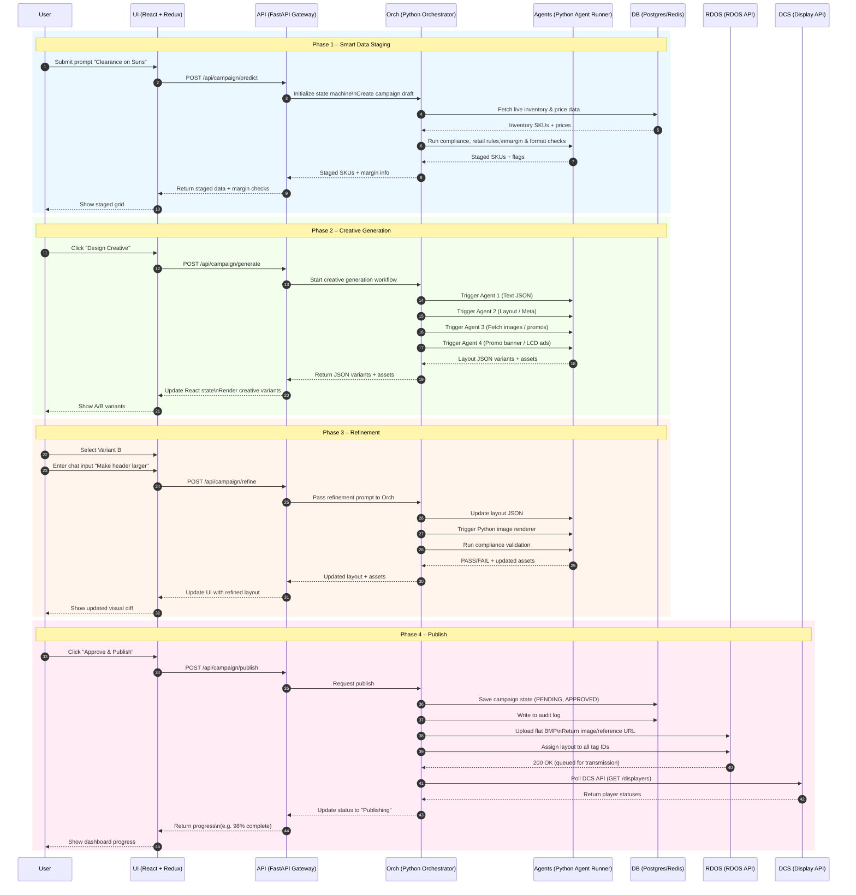

## Latest Promo Flow – Retail Campaign Builder

This document describes the **latest end‑to‑end flow** for the Retail Campaign Builder promo experience, matching the updated sequence diagrams shared by your senior. It is organised into four main phases: **Smart Data Staging**, **Creative Generation**, **Refinement**, and **Publish**.

### Actors / Systems

- **User**: Retail marketer using the promo builder.
- **UI (React + Redux)**: Frontend app where the user interacts with the promo builder.
- **API (FastAPI Gateway)**: Single backend entrypoint that exposes REST endpoints for campaign operations.
- **Orch (Python Orchestrator)**: Central workflow engine/state machine that coordinates agents, DB, and external systems.
- **Agents (Python Agent Runner)**: Specialized AI/automation agents for copy, layout, image generation, and rule validation.
- **DB (Postgres/Redis)**: Stores campaign data, inventory/price data, state machine state, and audit logs.
- **RDOS (RDOS API)**: Downstream system that receives final creative assets and layout assignments for tags.
- **DCS (Display API)**: Digital signage/display controller that reports player status and syncs published content.

### Phase 1 – Smart Data Staging

1. **User submits a promo brief** in the UI, e.g. `"Clearance on Suns"`.
2. UI calls **`POST /api/campaign/predict`** on the API.
3. API forwards the request to **Orch**, which **initializes a state machine** and creates a campaign draft.
4. Orch queries **DB** for **live inventory and pricing** for relevant SKUs.
5. Orch invokes **Agents** to run **compliance rules, retail rules, and margin/format checks** on candidate SKUs.
6. Agents return **staged SKUs with margin/compliance flags** back to Orch.
7. Orch sends the staged data and rule results back to **API**, which returns it to the **UI**.
8. UI updates its state and **shows a staged grid** of SKUs and margin checks to the user.

### Phase 2 – Creative Generation

1. User clicks **“Design Creative”** in the UI for a staged campaign.
2. UI calls **`POST /api/campaign/generate`**.
3. API instructs **Orch** to start the **creative generation workflow** for the current campaign state.
4. Orch fans out work to **multiple Agents**:
   - **Agent 1**: Generates **text and copy JSON** for the creative.
   - **Agent 2**: Proposes **layout metadata** (zones, placements, sizes).
   - **Agent 3**: Fetches or selects **images/promos** for assets.
   - **Agent 4**: Produces **banner/LCD-specific variants** when needed.
5. Agents return **layout JSON variants + assets** to Orch.
6. Orch aggregates results and sends them back through **API → UI**.
7. UI updates the page and **renders multiple creative variants (e.g. A/B)** for the user to compare.

### Phase 3 – Refinement

1. User **selects a preferred variant** (e.g. Variant B) in the UI.
2. User enters a **refinement chat prompt**, e.g. `"Make header larger"`.
3. UI calls **`POST /api/campaign/refine`** with the selected variant and refinement prompt.
4. API passes the request to **Orch**, which updates the current workflow context.
5. Orch calls **Agents** to:
   - **Adjust layout JSON** (e.g. header size, font, positioning).
   - **Regenerate images** when needed using the **Python image renderer**.
   - **Re-run compliance validation** to ensure updated layout still passes rules.
6. Agents return **PASS/FAIL plus updated assets/layout**.
7. Orch persists any necessary state and sends updated layout + assets back via **API → UI**.
8. UI **re-renders the creative** and shows a **visual diff** of the previous vs refined design to the user.

### Phase 4 – Publish

1. After reviewing the refined creative, the user clicks **“Approve & Publish”**.
2. UI calls **`POST /api/campaign/publish`**.
3. API instructs **Orch** to **transition the campaign to a publishing state**.
4. Orch:
   - Persists **campaign status** in **DB** (e.g. `PENDING`, then `APPROVED`).
   - Writes an **audit log entry** for governance and traceability.
5. Orch exports a **flat BMP or other render output** and **uploads it to RDOS**, receiving an image/reference URL.
6. Orch uses **RDOS** to **assign the layout to all tag IDs** / endpoints that should display the creative.
7. RDOS confirms with a **200 OK** indicating the creative is **queued for transmission** to devices.
8. Orch periodically **polls DCS** (e.g. `GET /displayers`) to check **player statuses and sync state**.
9. Orch updates campaign progress and status and returns this back to **API**.
10. API responds to the UI with **progress updates** (e.g. `98% complete`) and final **“Publishing” / “Live”** status.
11. UI surfaces this status in dashboards so the user can **monitor publishing progress** end‑to‑end.

### Mermaid Sequence Diagram (Latest Flow)

Use the following Mermaid definition to render the latest promo flow diagram:

